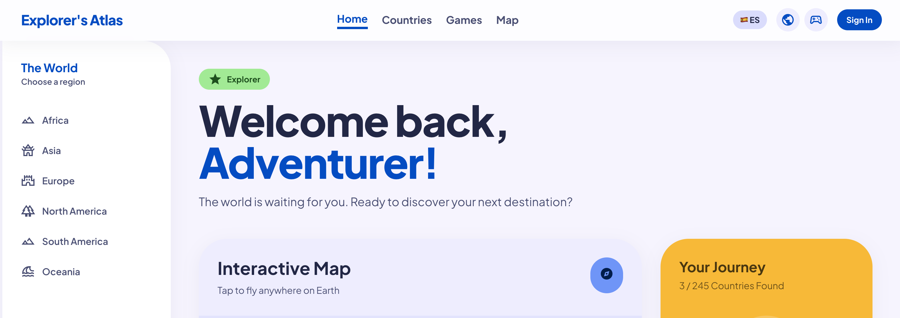
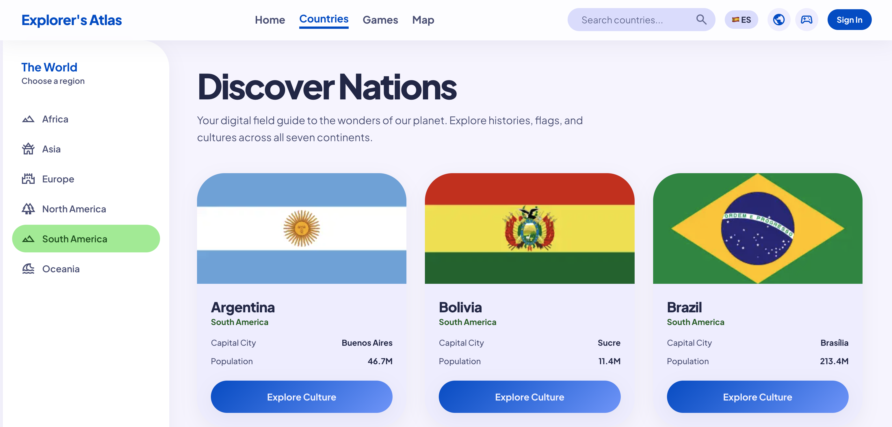
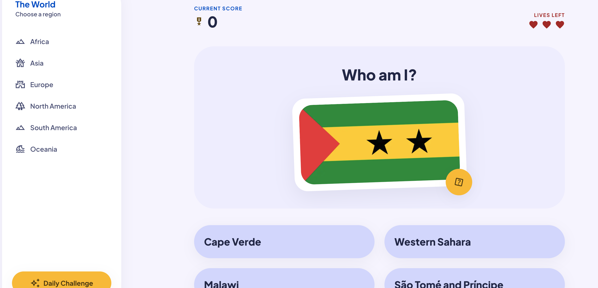

# 🌍 Explorer's Atlas

**Explore every nation on Earth. Learn their flags. Test your knowledge.**

Explorer's Atlas is an interactive geography app covering all **245 countries and territories** across 7 continents. Discover cultures, play flag quizzes, track your progress, and challenge yourself — all in English or Spanish.



---

## ✨ Features

- **🗺️ Countries Catalog** — Browse all 245 nations with flags, capitals, populations and continents. Filter by region, or search by name.
- **🎮 Flag Quiz** — See a flag, pick the right country from 4 options. 3 lives, score tracking, and a Daily Challenge mode to keep you coming back.
- **📈 Personal Journey** — Your progress is saved automatically. See how many countries you've discovered and your quiz high score.
- **🔐 Sign In with Google** — One click to save your progress across devices and sessions.
- **🌐 Bilingual** — Full English and Spanish interface (EN / ES).
- **👤 No account required** — Start exploring instantly as a guest; sign in whenever you're ready.

---

## 📸 Screenshots

### Dashboard


### Countries Catalog


### Flag Quiz


---

## 🚀 Getting Started

### Prerequisites

- Node.js 18+
- A Firebase project (free tier is enough)

### Install & run

```bash
git clone https://github.com/fonseka-dev/fun-with-flags.git
cd fun-with-flags
npm install
cp .env.local.example .env.local   # then fill in your Firebase credentials
npm run dev
```

Open [http://localhost:3000](http://localhost:3000).

---

## 🔥 Firebase Setup

The app uses Firebase for anonymous sessions, Google Sign-In, and progress persistence via Firestore. Follow the step-by-step guide:

> 1. Create a Firebase project at [console.firebase.google.com](https://console.firebase.google.com)
> 2. Enable **Anonymous Authentication** and **Google Sign-In**
> 3. Create a **Firestore** database
> 4. Copy your config into `.env.local` using the variables in `.env.local.example`

The app works without Firebase — sign-in and progress tracking will simply be inactive.

---

## 🧪 Running Tests

```bash
npm test
```

31 unit tests covering auth flows, country data, and quiz logic.

---

## � Deployment

The app is hosted on **Firebase Hosting** with Cloud Run for server-side rendering.

### How it works

Merging a PR into `main` triggers an automatic deploy to Firebase Hosting via GitHub Actions.

### Branching strategy

```
feature/my-feature  →  PR  →  development  →  PR  →  main  →  auto-deploy
```

| Branch | Purpose |
|---|---|
| `main` | Production — auto-deploys to Firebase |
| `development` | Integration — merge features here first |
| `feature/*` | Short-lived feature branches |

### Manual deploy (if needed)

```bash
npm run build
npx firebase deploy --only hosting
```

Requires Firebase CLI (`npm install -g firebase-tools`) and `firebase login`.

---

## �🛠️ Tech Stack

| Layer | Technology |
|---|---|
| Framework | Next.js 16 (App Router) |
| Language | TypeScript |
| Styling | Tailwind CSS |
| Auth & DB | Firebase (Anonymous Auth, Google Sign-In, Firestore) |
| i18n | next-intl (EN / ES) |
| Testing | Vitest |

---

## 📁 Project Structure

```
src/
├── app/              # Next.js App Router pages
├── components/       # Reusable UI components
├── lib/              # Firebase client, auth provider, helpers
└── messages/         # i18n translation files (en.json, es.json)
scripts/              # Country data seeding scripts
public/               # Static assets
```

---

## 🤝 Contributing

Contributions are welcome! To get started:

1. Fork the repo
2. Create a feature branch: `git checkout -b feat/your-feature`
3. Commit using [Conventional Commits](https://www.conventionalcommits.org/): `feat(quiz): add timer mode`
4. Push and open a Pull Request

---

## 📄 License

Licensed under the [Apache License 2.0](LICENSE).
